# AniPainter
Animate

Documentation coming soon..

    
    
    
    

    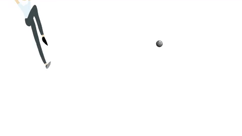
    
    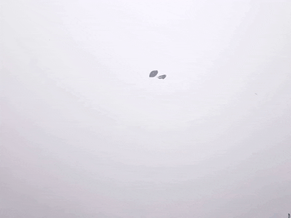

## Stroke-Based Rendering Algorithm

We use K-means clustering on the target image to get the k discrete colors used for painting.

Using these k colors, we discretize the colors in the target image by changing each pixel to it’s most similar allowed color using euclidean distance.  Discretizing the target image first allows the algorithm to generate longer brush strokes.

Below (left to right) is the original image, the 12 colors of paint to use, and the image where each pixel color is one of the 12.

    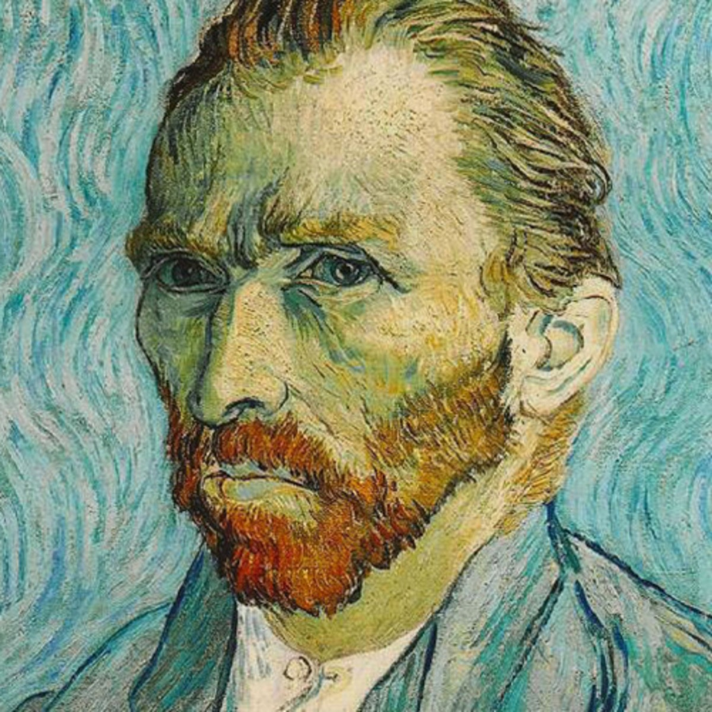
    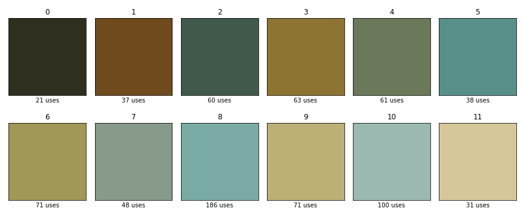
    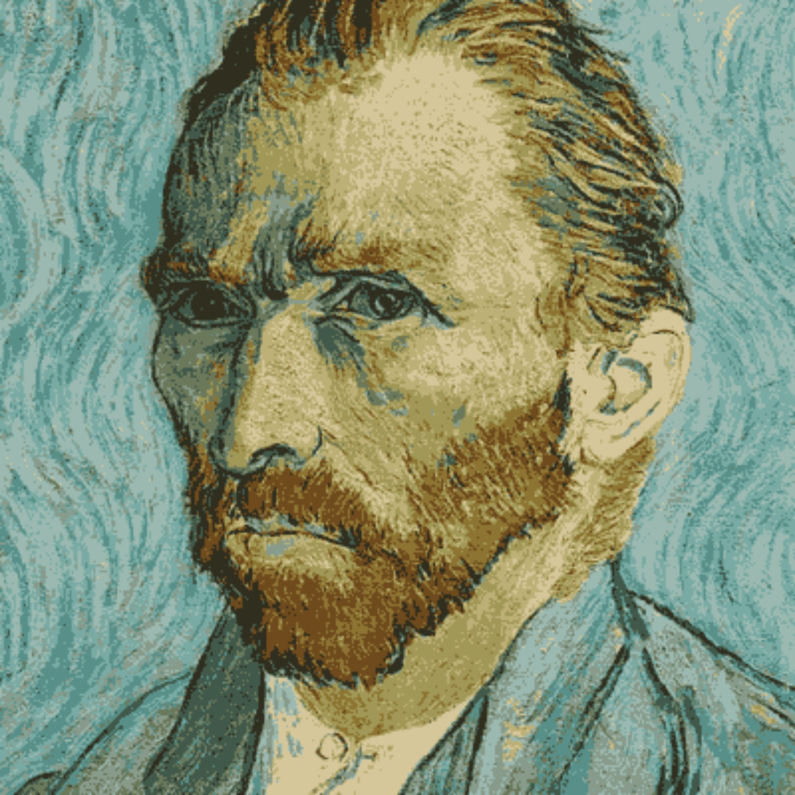

We usually use just one width brush, but this algorithm can work for a list of brush sizes, say working from big to small.

We start with a white canvas and wish to apply brush strokes such that the difference between the canvas and the target image is minimized.

For each brush width, we’ll try to generate up to a user specified number of brush strokes.

For each brush stroke attempt:

We decide on a starting location for the brush stroke by calculating the mean absolute error between the canvas and the target image across RGB channels.  The location with the greatest difference is our starting point.  We actually clip this difference at a certain value so that it doesn’t just paint the dark colors first. Below is the difference between the image and the white starting canvas.  In red is the point selected as the starting point for the first stroke:

    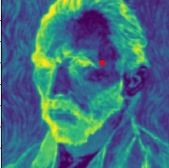

Now we need to elongate this stroke so that we’re painting and not just doing pointillism.

The color of our stroke is the color of the reference image at our starting point.

We subtract the stroke color from the reference image, then we look in the area around our starting point.  Our next point is in the direction where the stroke color helps our canvas become more like the reference image. This point is shown in red below:

    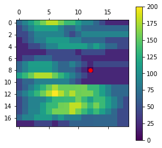

Each point in the stroke is represented by a circle of the given radius.

The stroke meanders and can snake around up to a maximum length or to where it stops decreasing the loss. 

    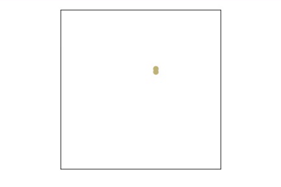
    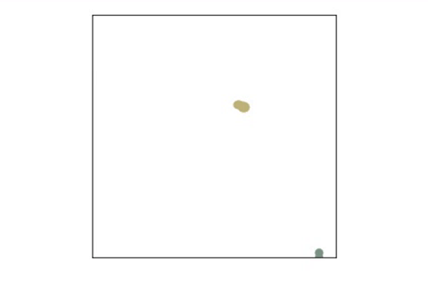
    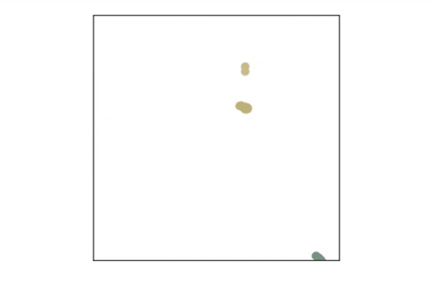

Our machine paints bezier curves, so we need to translate these unstructured curves to three points.  We do this by performing PCA on the points to project them onto a line.  We take the first last and middle points on this line as the points for our bezier curve.

    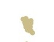
    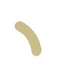

Once we decide on the brush stroke, we can still reject the stroke depending on how much it helps or hurts the loss between our canvas and the target image.

We keep adding strokes in this manner until we hit the maximum number of strokes set.  Then we can move onto another brush size or just return the canvas and brush stroke list.

    
    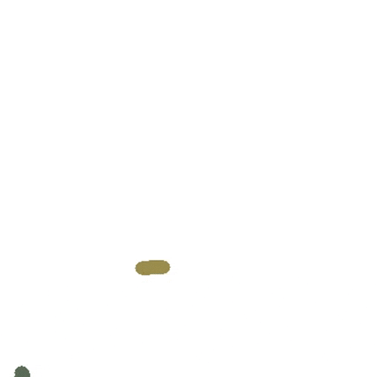

Another Example:

    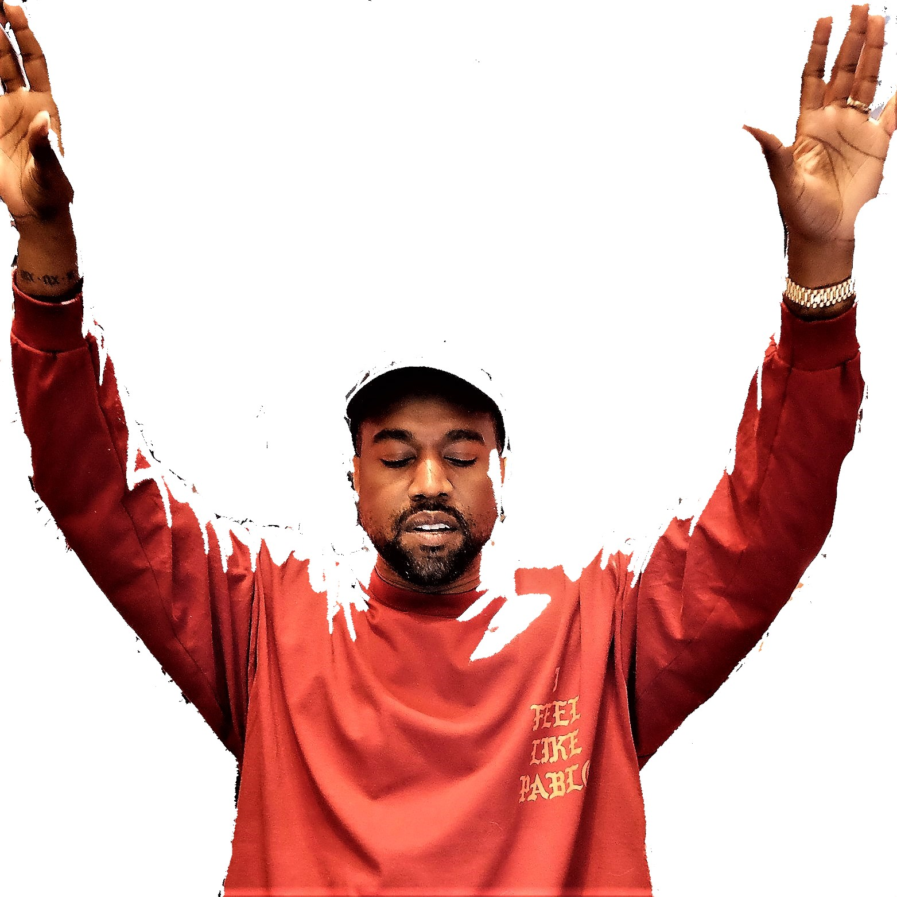
    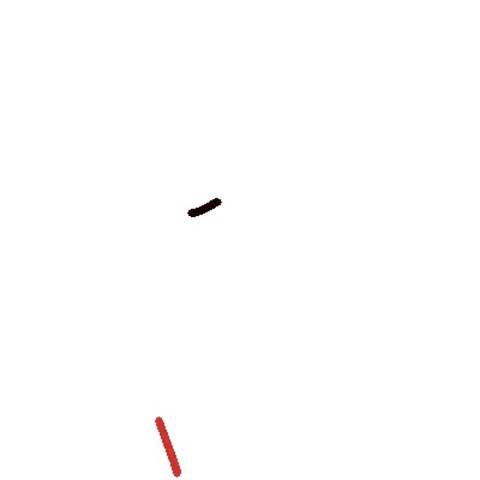

