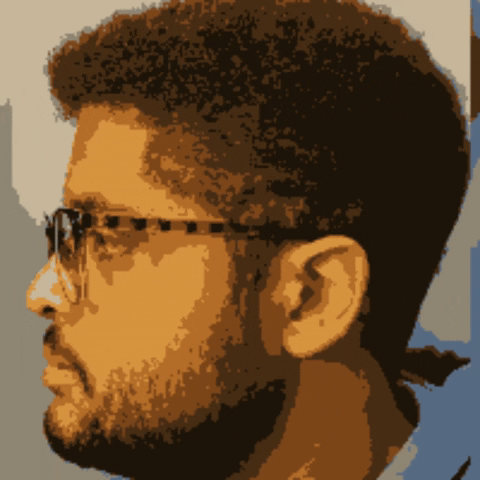
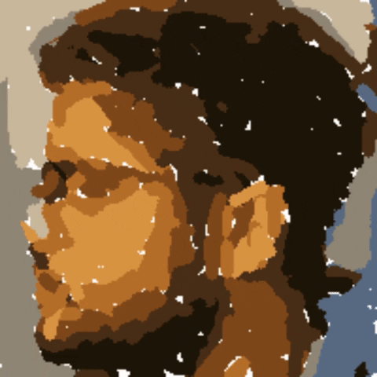
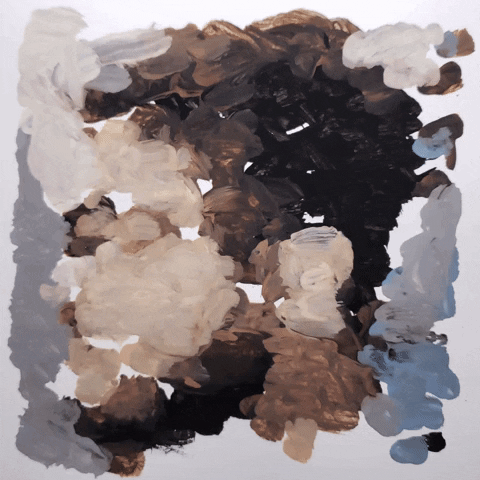
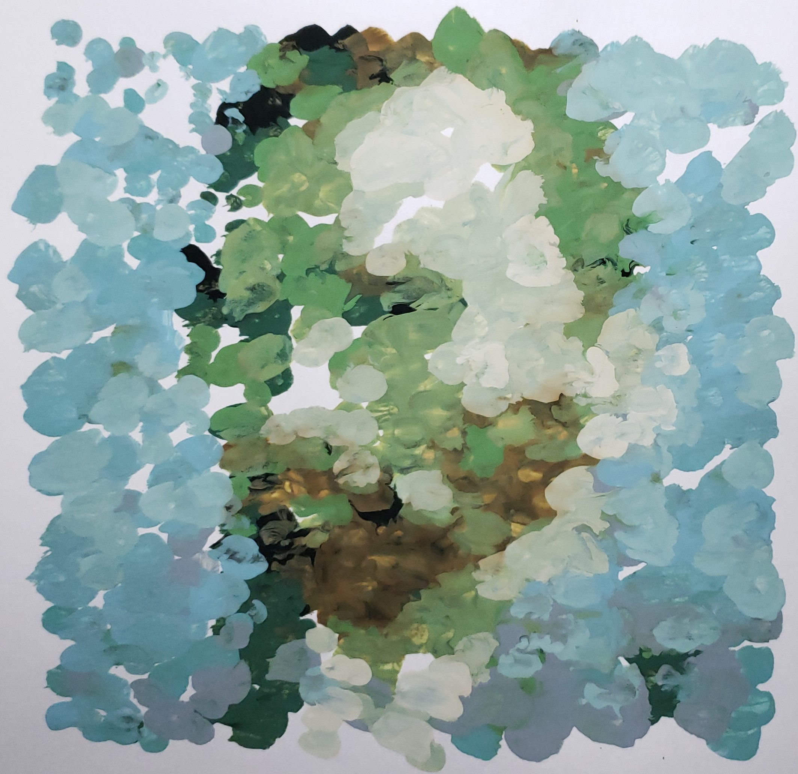

# AniPainter
Animate a video or paint an image by running our stroke-based rendering algorithm over your video/image.  Convert your image/video into a list of brush stroke instructions for a robot painter.  We use a TinkerKit Braccio robot arm.  [Robot code is available here](https://create.arduino.cc/editor/skeeter_man/c5805760-4e8c-48e7-898d-a6abf2ed9097/preview)


<p align="center">
    
    
    
    
</p>

Without stylizing the video first:

<p align="center">
    
    
    
</p>


## Usage

```
python paint.py <video or image> [--max_strokes 600] [--r 6] [--w 200] [--ignore_whites True] [--n_colors 12] [--animation_fps 10] [--output_dir animation_instructions]
```

- `<video or image>` - The path to the video or image file to paint. Supported types: .avi, .mp4, .mpeg, .mov, .jpg, .jpeg, .png, or .bmp
- `--max_strokes` - Maximum number of brush strokes to try to generate.
- `--r` - Radius of the paint brush in pixels.
- `--w`, `--h` - Width and Height of the canvas in pixels. This size strongly affects speed of the algorithm.
- `--ignore_whites` - Do not include while paint strokes in the actions.csv.  Our robot paints on white paper, so the white paint isn't always necessary.
- `--n_colors` - Number of discrete paint colors to use.
- `--animation_fps` - How many frames per second the output should be.  Needs to be less than or equal to the input video's fps.
- `--output_dir` - Where to save the instructions.

## Output
In the `output_dir` (note: if you're painting a video it will be as many directories as frames):
- `actions.csv` - List of brush stroke instructions for the robot.
  - Each row contains 13 values: `x0, y0, x1, y1, x2, y2, r0, r1, o0, o1, c0, c1, c2`
  - `x`'s and `y`'s describe a bezier curve.
  - `r` is the radius in pixels at either end of the stroke (`r0` and `r1` are always the same).
  - `o` describes the opacity of the stroke which is always an opaque 1.0
  - `c` describes the color of the stroke in reference to the index of the color in `output_dir/[]/colors.png` (the index is labelled above each color).
- `target.jpg` - Image prior to painting, discretized using the `n_colors` of paint.
- `painting.jpg` - The output painting with potentially more than `n_colors` of paint.
- `discrete_painting.jpg` - The output painting using the `n_colors` of paint.
- `colors.png` - The `n_colors` of paint along with how many times they were used.

<p align="center">
    
    
    
</p>

Original animation above via [Colin Van 't Veld](https://www.instagram.com/colindesign/?hl=en)

<p align="center">
    
</p>

The painting process is shown above. A given video is broken up into frames, the frames can be styled using a style/texture image, each frame is then converted into a sequence of brush stroke instructions that can be rendered on the computer, and lastly the robot paints the instructions.

## Stroke-Based Rendering Algorithm

We use K-means clustering on the target image to get the k discrete colors used for painting.


Using these k colors, we discretize the colors in the target image by changing each pixel to it’s most similar allowed color using euclidean distance.  Discretizing the target image first allows the algorithm to generate longer brush strokes.

Below (left to right) is the original image, the 12 colors of paint to use, and the image where each pixel color is one of the 12.

<p align="center">
    
    
    
</p>

We usually use just one width brush, but this algorithm can work for a list of brush sizes, say working from big to small.

We start with a white canvas and wish to apply brush strokes such that the difference between the canvas and the target image is minimized.

For each brush width, we’ll try to generate up to a user specified number of brush strokes.

For each brush stroke attempt:

We decide on a starting location for the brush stroke by calculating the mean absolute error between the canvas and the target image across RGB channels.  The location with the greatest difference is our starting point.  We actually clip this difference at a certain value so that it doesn’t just paint the dark colors first. Below is the difference between the image and the white starting canvas.  In red is the point selected as the starting point for the first stroke:

<p align="center">
    
</p>

Now we need to elongate this stroke so that we’re painting and not just doing pointillism.

The color of our stroke is the color of the reference image at our starting point.

We subtract the stroke color from the reference image, then we look in the area around our starting point.  Our next point is in the direction where the stroke color helps our canvas become more like the reference image. This point is shown in red below:

<p align="center">
    
</p>

Each point in the stroke is represented by a circle of the given radius.

The stroke meanders and can snake around up to a maximum length or to where it stops decreasing the loss.

<p align="center">
    
    
    
</p>

Our machine paints bezier curves, so we need to translate these unstructured curves to three points.  We do this by performing PCA on the points to project them onto a line.  We take the first last and middle points on this line as the points for our bezier curve.

<p align="center">
    
    
</p>

Once we decide on the brush stroke, we can still reject the stroke depending on how much it helps or hurts the loss between our canvas and the target image.

We keep adding strokes in this manner until we hit the maximum number of strokes set.  Then we can move onto another brush size or just return the canvas and brush stroke list.

<p align="center">
    
    
</p>

Another Example:
<p align="center">
    
    
</p>

## The Robot Painter

We use a TinkerKit Braccio robot arm shown below.  [Robot code is available here](https://create.arduino.cc/editor/skeeter_man/c5805760-4e8c-48e7-898d-a6abf2ed9097/preview)  This arm retails for about $220 USD, making it the least expensive robot we've been able to find for painting by a factor of 3-100.

<p align="center">
    
</p>

Since the robot is low-end, its accuracy is far below other robot painters.  The arm paints 20x20cm paintings with up to 12 colors.  It performs about 14 strokes per minute.  A paint brush is attached to the arms hand, and multiple brushes can be used while painting.


<p align="center">
    
    
</p>